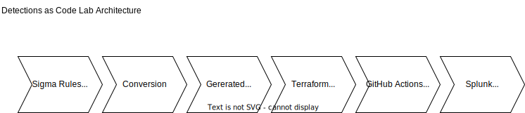

# Sigma-to-Splunk CI/CD Detection Engineering Pipeline
  
Automated pipeline to validate, convert, and deploy Sigma detection rules to Splunk via Terraform and GitHub Actions.
This project demonstrates production-style detection engineering practices including version control, rule validation, MITRE ATT&CK mapping, macro abstraction, and Terraform-based deployment.

Key Benefits:  
- Version-controlled detection rules  
- Automated testing and validation  
- Consistent deployment across environments  
- Rapid detection deployment  
- Collaboration and peer review  
- Rollback capabilities 

-------  

## Technology Stack  
  
| Component        | Technology        | Purpose                           |
| ---------------- | ----------------- | --------------------------------- |
| Detection Format | Sigma             | Universal detection rule format   |
| IaC Tool         | Terraform         | Infrastructure as Code for Splunk |
| CI/CD            | GitHub Actions    | Automation and orchestration      |
| Runner           | Self-Hosted       | Execute jobs in lab environment   |
| SIEM             | Splunk Enterprise | Detection deployment target       |
| Version Control  | Git/GitHub        | Source control and collaboration  |

--------------

## Architecture

  

---

## Documentation

- [Documentation](./docs/DETECTION_PIPELINE.md) 

--------------

## Workflow

- Store Sigma rules in `rules/`  
- Convert rules to Splunk SPL in CI  
- Generate Terraform resources (splunk_saved_search) from generated SPL  
- Apply Terraform to deploy saved searches and other Splunk infrastructure

--------------

## Demonstrated Skills

- DevOps/SecOps Practices
	- Infrastructure as Code (Terraform)
	- CI/CD pipeline design
	- Automated testing
- Detection Engineering
	- Sigma rule development
	- Query optimization
	- False positive tuning
- Version Control
	- Git workflows
	- Pull request reviews
	- Branch protection
- Automation
	- GitHub Actions
	- Python scripting
- SIEM Management
	- Splunk API integration
	- Programmatic deployment
	- Alert configuration
- Quality Assurance
	- Automated testing
	- Validation checks
	- Rollback capabilities
- Scalability
	- Repeatable processes
	- Environment consistency
  
-----------------

## Future Enhancements  

- Multi-SIEM Support  
    - Add Elastic backend  
    - Add Sentinel backend  
- Advanced Testing  
    - Unit tests for rules  
    - Integration tests  
    - Performance benchmarking  
- Compliance Mapping  
    - Map to compliance frameworks  
    - Generate compliance reports  
  
This Detection-as-Code pipeline demonstrates modern security engineering practices and  
DevSecOps principles highly valued in SOC environments.  

